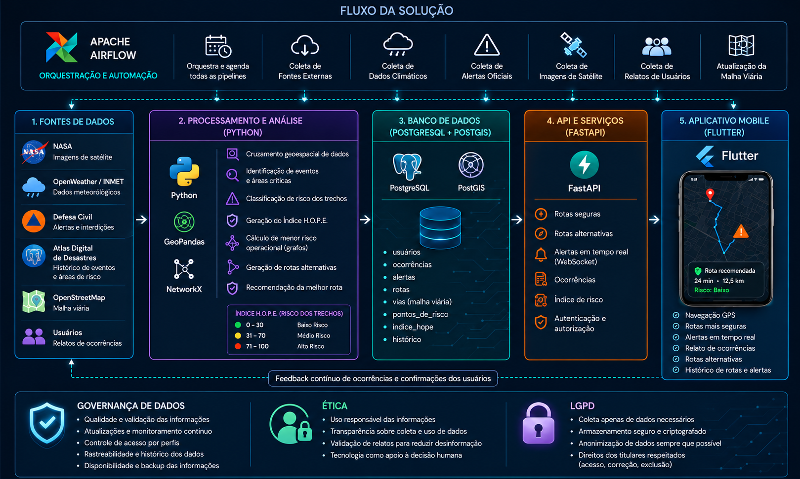
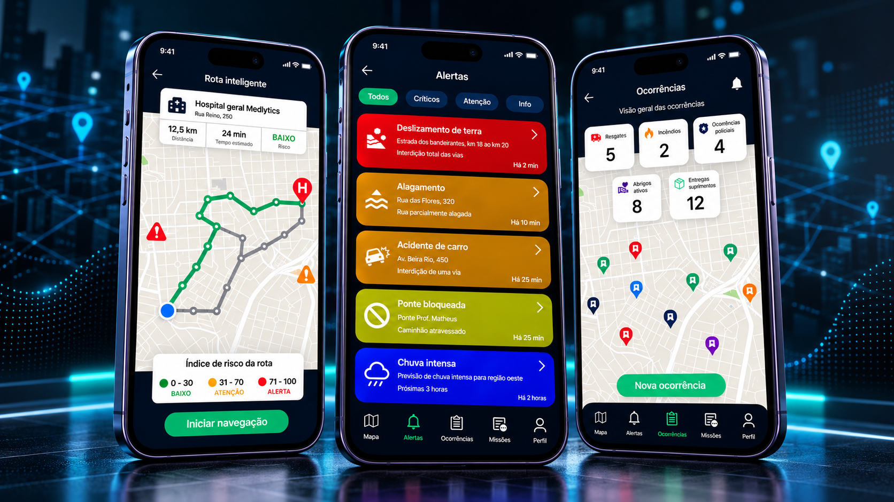
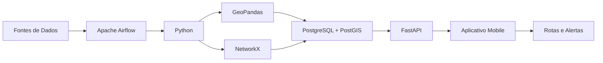

<div align="center">

<div align="center">
  
</div>

# H.O.P.E.

### Humanitarian Operations for Prediction and Emergency Response

**Prevendo obstáculos. Entregando esperança.**

<br>


<br>

**Global Solution • FIAP 2026**

</div>

---

## 🌎 Sobre o Projeto

O **H.O.P.E.** é um protótipo acadêmico desenvolvido para explorar como dados, inteligência computacional e tecnologias geoespaciais podem auxiliar equipes de emergência durante situações de desastre.

Eventos como **enchentes, deslizamentos, incêndios florestais e tempestades severas** podem alterar rapidamente as condições de acesso a determinadas regiões. Estradas podem ser bloqueadas, pontes interditadas e comunidades inteiras podem ficar isoladas.

Nesse cenário, equipes de emergência precisam tomar decisões rápidas mesmo quando as informações sobre acessibilidade e risco estão mudando constantemente.

A proposta do H.O.P.E. é funcionar como um **sistema inteligente de apoio à navegação em emergências**, integrando diferentes fontes de dados para identificar áreas de risco e sugerir rotas alternativas mais seguras.

> **Quando cada minuto pode significar uma vida salva, encontrar o caminho certo faz toda a diferença.**

---

## 🎯 Objetivo

O H.O.P.E. busca utilizar dados e tecnologia para apoiar equipes de emergência em cenários críticos, oferecendo informações que auxiliem no planejamento e na tomada de decisão em campo.

Entre os principais objetivos da solução estão:

- Identificar áreas e trechos de risco;
- Integrar informações meteorológicas, geográficas e de ocorrências;
- Sugerir rotas alternativas;
- Evitar áreas potencialmente bloqueadas ou perigosas;
- Apoiar a distribuição de recursos emergenciais;
- Reduzir o tempo de deslocamento até as vítimas;
- Melhorar a coordenação entre equipes de emergência.

---

## 💡 Como a solução funciona

O H.O.P.E. foi concebido como um sistema capaz de combinar diferentes fontes de dados para gerar informações relevantes sobre o ambiente e as condições das rotas.

```text
DADOS EXTERNOS
      ↓
APACHE AIRFLOW
      ↓
PROCESSAMENTO EM PYTHON
      ↓
ANÁLISE GEOESPACIAL
      ↓
POSTGRESQL + POSTGIS
      ↓
FASTAPI
      ↓
APLICATIVO MOBILE
      ↓
ROTAS + ALERTAS + ÍNDICE DE RISCO
```

A solução utiliza dados de diferentes fontes, como informações meteorológicas, imagens de satélite, alertas oficiais, mapas e relatos de usuários.

Esses dados passam por processos de análise e cruzamento geoespacial para identificar eventos críticos, classificar o risco dos trechos e apoiar a geração de rotas alternativas.

---

## 🏗️ Arquitetura da Solução

<div align="center">



</div>

### 1. Fontes de Dados

A solução prevê integração com diferentes fontes:

- **NASA** — imagens de satélite;
- **OpenWeather / INMET** — dados meteorológicos;
- **Defesa Civil** — alertas e interdições;
- **Atlas Digital de Desastres** — histórico de eventos e áreas de risco;
- **OpenStreetMap** — informações da malha viária;
- **Usuários** — relatos de ocorrências.

---

### 2. Orquestração

O **Apache Airflow** é utilizado como camada de orquestração, responsável por organizar e automatizar os pipelines de coleta e processamento dos dados.

---

### 3. Processamento e Análise

O processamento é realizado principalmente com **Python**, utilizando ferramentas voltadas à análise geoespacial e algoritmos de grafos.

#### GeoPandas

Utilizado para trabalhar com dados espaciais e realizar operações como:

- cruzamento geográfico;
- análise de áreas de risco;
- manipulação de informações georreferenciadas.

#### NetworkX

Utilizado para representar a malha viária como um **grafo**, permitindo explorar cálculos de caminho e geração de rotas considerando diferentes condições de risco.

---

### 4. Índice H.O.P.E.

A arquitetura prevê um índice para representar o nível de risco dos trechos analisados:

```text
0  ───────── 30      BAIXO RISCO
31 ───────── 70      MÉDIO RISCO
71 ───────── 100     ALTO RISCO
```

Esse índice pode ser utilizado durante o cálculo das rotas para priorizar caminhos com menor risco operacional.

---

### 5. Banco de Dados

O projeto prevê o uso de:

**PostgreSQL + PostGIS**

O banco pode armazenar informações como:

```text
• usuários
• ocorrências
• alertas
• rotas
• vias
• pontos de risco
• índice H.O.P.E.
• histórico
```

O **PostGIS** adiciona recursos geoespaciais ao PostgreSQL, permitindo trabalhar com coordenadas, regiões, distâncias e informações relacionadas à localização.

---

### 6. API e Serviços

A camada de serviços é proposta utilizando **FastAPI**.

Entre os serviços previstos estão:

- consulta de rotas seguras;
- rotas alternativas;
- alertas em tempo real;
- registro de ocorrências;
- consulta do índice de risco;
- autenticação e autorização.

---

## 📱 Protótipo do Aplicativo

<div align="center">



</div>

O aplicativo foi idealizado para centralizar informações relevantes para equipes de emergência durante operações em campo.

### Funcionalidades propostas

📍 **Rotas inteligentes**  
Navegação considerando o índice de risco dos trechos.

⚠️ **Alertas em tempo real**  
Visualização de eventos críticos e condições que possam afetar uma rota.

🗺️ **Rotas alternativas**  
Sugestão de caminhos alternativos quando uma região apresenta risco elevado.

🚑 **Missões e ocorrências**  
Acompanhamento de equipes e eventos associados à operação.

👤 **Perfis personalizados**  
Possibilidade de atender diferentes tipos de equipes, como ambulâncias, bombeiros e hospitais.

📊 **Índice de risco**  
Classificação visual dos trechos considerando diferentes níveis de risco.

---

## 🧠 Tecnologias Utilizadas

<div align="center">

<table>
<tr>
<td align="center"><b>Área</b></td>
<td align="center"><b>Tecnologias</b></td>
</tr>

<tr>
<td>Processamento</td>
<td>Python</td>
</tr>

<tr>
<td>Análise Geoespacial</td>
<td>GeoPandas</td>
</tr>

<tr>
<td>Grafos</td>
<td>NetworkX</td>
</tr>

<tr>
<td>Orquestração</td>
<td>Apache Airflow</td>
</tr>

<tr>
<td>Banco de Dados</td>
<td>PostgreSQL + PostGIS</td>
</tr>

<tr>
<td>API</td>
<td>FastAPI</td>
</tr>

<tr>
<td>Aplicativo</td>
<td>Flutter</td>
</tr>

<tr>
<td>Containerização</td>
<td>Docker</td>
</tr>

</table>

</div>

---

## 🔄 Fluxo Simplificado



---

## 🛡️ Governança, Ética e LGPD

A arquitetura também considera princípios relacionados à segurança, governança e uso responsável dos dados.

### Governança de Dados

- qualidade e validação das informações;
- atualizações e monitoramento contínuo;
- controle de acesso;
- rastreabilidade;
- histórico dos dados;
- disponibilidade e backup das informações.

### Ética

- uso responsável das informações;
- transparência sobre coleta e utilização dos dados;
- validação de relatos;
- tecnologia como ferramenta de apoio à decisão humana.

### LGPD

- coleta apenas dos dados necessários;
- armazenamento seguro e criptografado;
- anonimização quando aplicável;
- respeito aos direitos dos titulares.

---

## 📈 Impactos e Benefícios Esperados

### Impacto Social

- redução do tempo de resposta das equipes de emergência;
- maior apoio a vítimas em situações críticas;
- agilidade na entrega de medicamentos, alimentos e água;
- apoio a comunidades isoladas;
- maior coordenação entre órgãos de emergência.

### Impacto Logístico

- melhor planejamento de entregas emergenciais;
- priorização de rotas para suprimentos críticos;
- redução de atrasos;
- maior cobertura de regiões isoladas.

---

## 🧪 Status do Projeto

```text
STATUS: PROTÓTIPO ACADÊMICO

[✓] Definição do problema
[✓] Proposta da solução
[✓] Arquitetura
[✓] Fluxo de dados
[✓] Protótipo visual
[✓] Estudo das tecnologias
[ ] Implementação completa
[ ] Ambiente de produção
```

O projeto foi desenvolvido como um **protótipo acadêmico**, com foco na concepção da solução, definição da arquitetura, exploração das tecnologias e criação da experiência proposta para o usuário.

---

## 🎥 Pitch do Projeto

<div align="center">

### Conheça a proposta da H.O.P.E.

[](https://youtu.be/XrEyUsTjhC0)

</div>

---


## 🎓 Contexto Acadêmico

<div align="center">

**FIAP — Data Science**

Global Solution 2026

<br>

`Data Science` • `Artificial Intelligence` • `Cloud` • `Data Engineering`

</div>

---

<div align="center">

## H.O.P.E.

### Humanitarian Operations for Prediction and Emergency Response

**Prevendo obstáculos. Entregando esperança.**

<br>

*Tecnologia e informação trabalhando juntas para apoiar decisões quando cada segundo importa.*

</div>
